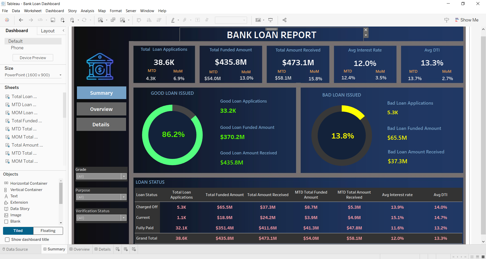
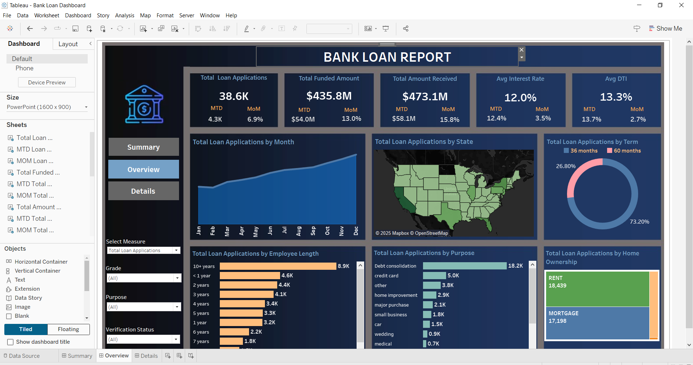
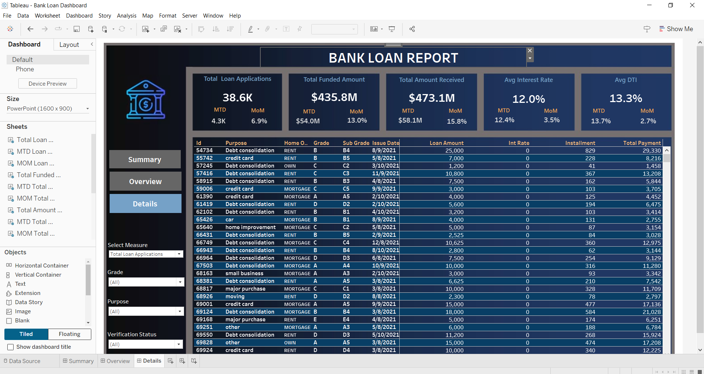

# Loan_aproval_rate_analysis_using_Tableau

## 📄 Overview
This repository contains a Tableau-based analytical dashboard that provides an in-depth analysis of bank loans. The project emphasizes key performance indicators (KPIs), borrower behavior, and lending trends to support data-driven decision-making for financial institutions. By integrating advanced data visualization techniques, this dashboard empowers users to identify risk patterns, analyze repayment trends, and evaluate the health of the loan portfolio.

---

## 💡 Objective
The primary goal of this project is to develop a visually interactive and insightful dashboard that assists banks in monitoring their lending activities, assessing risks, and understanding borrower profiles. By leveraging Tableau's capabilities, the dashboard offers:
- Real-time updates on lending metrics.
- Comparative insights on **Good Loans** vs. **Bad Loans**.
- Month-over-Month (MoM) and Month-to-Date (MTD) trends for strategic planning.

---

## 🔑 Features
### **1. Comprehensive Dashboards**
The Tableau workbook includes three interactive dashboards, each designed for specific analytical purposes:
- **Summary Dashboard**:
  - Highlights KPIs like total loan applications, funded amounts, and repayments.
  - Provides a **Good Loan vs. Bad Loan** breakdown using percentage metrics and visual gauges.
- **Overview Dashboard**:
  - Analyzes monthly trends, regional loan distribution, and borrower segmentation (e.g., employment length, loan purpose).
  - Includes line charts, bar charts, and filled maps for granular insights.
- **Details Dashboard**:
  - Consolidates all relevant metrics in a tabular format for in-depth exploration of the loan portfolio.

### **2. Key Performance Indicators (KPIs)**
The dashboard tracks and visualizes:
- **Loan Volume**:
  - Total loan applications.
  - MTD and MoM variations for proactive decision-making.
- **Funding Metrics**:
  - Total funded amount (principal disbursed to borrowers).
  - Good vs. bad loan funding analysis.
- **Borrower Metrics**:
  - **Debt-to-Income (DTI) Ratio**: Evaluates borrowers' financial health and repayment capacity.
  - **Interest Rate**: Indicates loan affordability and portfolio cost.

### **3. Good vs. Bad Loans Classification**
The project distinguishes between "Good Loans" and "Bad Loans" using the **Loan Status** field:
- **Good Loans**:
  - Status: "Fully Paid" or "Current."
  - Metrics: Applications, funded amounts, repayments, and percentages.
- **Bad Loans**:
  - Status: "Charged Off."
  - Metrics: Applications, funded amounts, repayments, and percentages.

### **4. Advanced Visualizations**
The dashboards incorporate diverse chart types:
- **Line Charts**: Display trends for applications, funding, and repayments over time.
- **Donut Charts**: Provide a comparative analysis of loan terms (36 months vs. 60 months).
- **Bar Charts**: Break down loans by purpose and employment length.
- **Filled Maps**: Visualize geographic loan distribution across states.
- **Tree Maps**: Analyze loan categories by home ownership status.

---

## 🛠️ Technical Implementation
### **1. Dataset**
The analysis is built on a structured dataset (`financial_loan.csv`) containing key fields such as:
- **Loan ID**: Unique identifier for tracking individual loans.
- **Loan Amount**: Principal amount disbursed.
- **Total Payment**: Payments received from borrowers.
- **Loan Status**: Indicates the loan's state (e.g., fully paid, charged off).
- **Issue Date**: Loan origination date.
- **DTI**: Borrower's debt-to-income ratio.
- **Interest Rate**: Annual percentage cost of borrowing.

### **2. Data Modeling**
SQL queries were used to pre-process the dataset and extract insights for visualization. Examples include:
- **Total Loan Applications**:
  ```sql
  SELECT COUNT(id) AS Total_Applications FROM bank_loan_data;
  ```
- **Average Interest Rate**:
  ```sql
  SELECT AVG(int_rate) * 100 AS Avg_Interest_Rate FROM bank_loan_data;
  ```
- **Good Loan Percentage**:
  ```sql
  SELECT (COUNT(CASE WHEN loan_status IN ('Fully Paid', 'Current') THEN id END) * 100.0) / COUNT(id) AS Good_Loan_Percentage 
  FROM bank_loan_data;
  ```
## Tableau Visualizations
The Tableau workbook (`Bank Loan Dashboard.twb`) leverages advanced visualization and data interaction techniques:

- **Filters**: Dynamic filters for fields such as grade, loan purpose, and verification status enable users to drill down into the data.
- **Calculated Fields**: Metrics such as Month-to-Date (MTD) and Month-over-Month (MoM) trends are calculated dynamically.
- **Chart Types**: A blend of charts like line graphs, bar charts, and maps are used for detailed comparative analysis.

---

## 📊 Dashboard Insights

### Key Visual Highlights

1. **Risk Analysis**:
   - Tracks the proportion of good vs. bad loans using gauges and bar charts.
   - Offers actionable insights into borrower profiles based on DTI and loan grades.

2. **Regional Trends**:
   - Identifies state-level disparities in loan applications and repayments using filled maps.

3. **Borrower Behavior**:
   - Analyzes employment length and loan purpose to understand borrower demographics.
   - Highlights trends in home ownership among borrowers using tree maps.

---

## ⚙️ Setup Instructions

1. Clone the repository:
   ```bash
   git clone https://github.com/your-username/Bank_Loan_Analysis_Tableau_Dashboard.git
   ```
2. Open the Tableau workbook (`Bank Loan Dashboard.twb`) in Tableau Desktop.
3. Connect the workbook to the provided `financial_loan.csv` dataset.
4. Explore the dashboards using the interactive filters and visualizations.

---

## 📚 Domain Knowledge

Understanding the loan lifecycle is critical for interpreting the dashboard:

1. **Loan Origination**: Applications are submitted, reviewed, and approved/denied.
2. **Risk Assessment**: Credit checks and DTI evaluations determine borrower eligibility.
3. **Repayment Monitoring**: Lenders track payments to assess portfolio health.
4. **Portfolio Management**: Banks adjust strategies based on repayment trends, borrower behavior, and geographic patterns.

---

## 🖼️ Screenshots

### Summary Dashboard


### Overview Dashboard


### Details Dashboard


---

## 🤝 Contribution

Contributions are welcome! If you have ideas for improvements or new features, feel free to open an issue or submit a pull request.

---

## 📧 Contact

For questions or feedback, reach out via GitHub or email.


